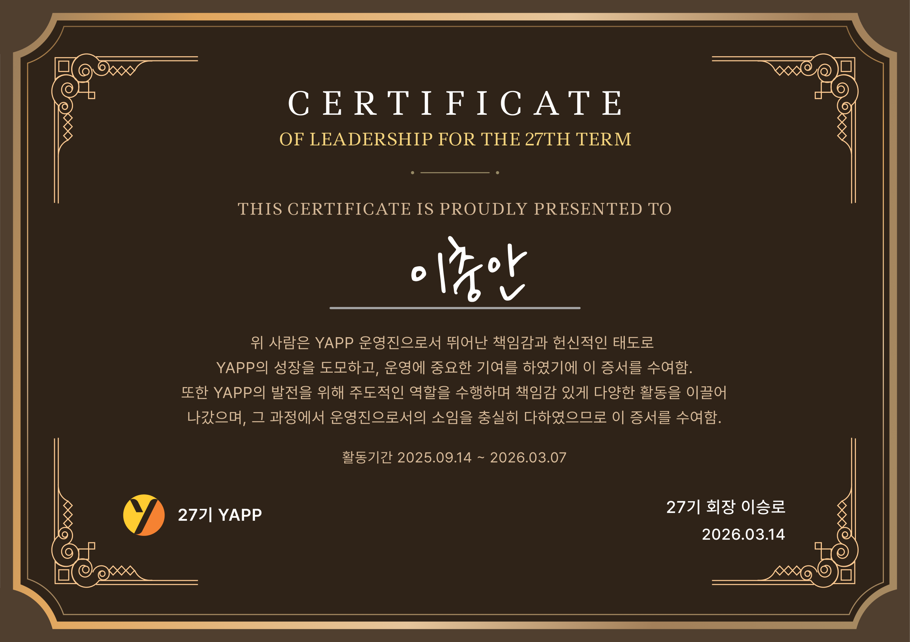
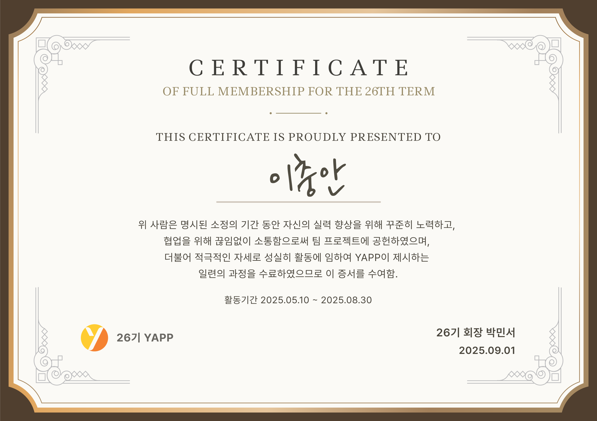

# YAPP

## About YAPP

- **기획자, 디자이너, 개발자**가 모여 **스타트업과 동일한 프로세스로 서비스를 만드는 실무 중심 IT 커뮤니티**입니다.
- 4개월 동안 활동하며, 아이디어 구상에 그치지 않고 **앱이나 웹 서비스를 완성하여 마켓에 출시하는 것을 목표**로 합니다.
- 2010년 창립 이후, 서비스 기획부터 개발·배포·운영까지 전 과정을 경험할 수 있는 플랫폼으로 성장했습니다.

## [27기 부회장] (25.09 ~ 26.03)

### [**총 9회, 60명 규모 IT 연합동아리 오프라인 커리큘럼 총괄 기획 및 운영**]

기획부터 대관, 운영 전 과정을 리딩하며 동아리 활동의 기술적/기획적 완성도를 높이는 커리큘럼 설계했습니다.

- [OT 세션](https://www.instagram.com/p/DRoore1CW-s) / [팀 매칭 세션](https://www.instagram.com/p/DR9Wtn-CRoy)
  - 6개 직군(PM, 디자인, 웹, 서버, iOS, Android)의 특성을 고려한 '테이블 로테이션 네트워킹' 기획
  - 명확한 타임라인과 직군별 선호도 투표/집계 시스템을 도입하여 100명 규모의 팀 빌딩을 혼선 없이 공정하게 완수
- [기획 세션](https://www.instagram.com/p/DTAG_I7CcDN)
  - 팀별 초기 기획안 발표 후, 초청한 현업 OB 멘토분들께 피드백을 받음 
  - '구글 폼을 활용한 구조화된 피드백' 환경을 구축하여 프로덕트의 방향성 구체화
- [UT 세션](https://www.instagram.com/p/DTffurQk-fi)
  - 15~20분 단위의 '순환 체험형 UT 구조'를 설계하여 실사용자 관점의 교차 피드백 수집
  - 2차 UT에서는 F-lab과 같이 백엔드/클라이언트 현업 개발자 멘토링을 진행하여 기술적 완성도와 UX 개선율 극대화
- [개발/디자인 세션](https://www.instagram.com/p/DTmIpJhCbg1)
  - 파트별 아키텍처와 설계 고민을 공유하는 자리를 마련함
  - 초청한 현업 OB 멘토분들께 실무 피드백을 받아 팀 별 기술적 완성도를 높임
- [해커톤 세션](https://www.instagram.com/p/DUIm2EdCQvZ)
  - 단기간 몰입을 위해 '로드맵 공유 → 집중 개발 → 데모 시연'의 체계적인 타임라인 설계
  - 간단한 이벤트, 순회 피드백 등 운영 리소스를 적절히 분배하여 팀별 핵심 기능 구현 촉진
- [데모데이](https://www.instagram.com/p/DVgX6eDie6X) / [성과공유회](https://www.instagram.com/p/DV4_vFFif-x)
  - 최대 100명 수용 공간의 동선을 기획하여 체험형 데모데이 진행
  - OB/YB 투표 시스템 운영 및 직군별/랜덤 네트워킹 타임을 기획하여 커뮤니티 결속력 강화 및 성공적인 프로젝트 회고 진행

### [**준비부터 선발까지 8주간의 채용 프로세스 엔드투엔드 관리**]

후보자 모집부터 OT까지의 전체 로드맵을 수립하고, 타이트한 일정 속에서 안정적 운영 달성했습니다.

- 채용 시스템의 체계화 : 이전 채용 자료를 분석하여 **35개 항목의 '채용 운영 체크리스트'로 표준화**, 담당자 간 커뮤니케이션 오류를 방지하고 운영 효율 개선
- 주간 단위 업무 로드맵 공유 및 리마인드 : 매주 일요일마다 각 직군별 운영진의 **주간 TODO 리스트를 세분화하여 공지**함으로써, 담당자별 역할을 명확히 하고 타이트한 일정 속 업무 누락 및 병목 현상 사전 방지
- 인재상 및 평가 가이드라인 수립 : 면접관용 가이드(채용 과정, 인재상, 직무별 평가 지표)를 문서화하여 평가의 객관성을 확보하고 동아리 방향성에 부합하는 인재 선발

### **[인사/PM/서버 3개 직무 리드 겸임: 조직 채용-운영 사이클 총괄]**

부회장 역할과 함께 **인사(HR), PM 리드, 서버 리드를 겸임**하며, 채용 시스템을 구축하고 직군 간 협업 프로세스를 고도화했습니다.

1. 인사(HR) 파트 총괄
   - 채용 프로세스 체계화: 채용 관리 솔루션인 '그리팅'을 적극 활용하여 약 300명 규모의 지원자 서류 검토, 이메일 발송, 면접 일정 조율 등 채용 전 과정을 효율적으로 매니징했습니다.
   - 대외 커뮤니케이션 창구 운영: 카카오톡 비즈니스 채널을 도입 및 운영하여 51건의 문의 사항에 신속하고 일관성 있게 대응했습니다.
   - 정량적 회원 데이터 관리: 구글 스프레드시트 기반의 관리 시스템을 구축하여, 48명 최종 선발 인원의 세션 출석 현황을 추적하고 수료 기준 달성 여부를 정확하게 측정했습니다.

2. PM 파트 리드 : 소통 브릿지 역할 및 팀 프로젝트 매니징 지원
   - 기술-기획 간 병목 해결: 개발 지식을 바탕으로 PM의 눈높이에 맞춘 맞춤형 기술 조언을 제공하여, 기획 단계의 병목을 해소하고 직군 간 협업 시너지를 주도했습니다.
   - 마일스톤 및 리스크 관리: 전체 세션 일정을 PM들에게 선제 공유하여 팀별 스프린트 계획 수립을 돕고, 2차례의 정기 1on1 미팅을 통해 팀 내부 갈등과 고충을 관리했습니다.

3. 서버(백엔드) 파트 리드 : 직무 맞춤형 인재 선발 주도
   - 직무 맞춤형 채용 기준(JD) 및 평가 지표 설계: '논리적 문제 해결력'과 '주도적인 협업 태도'를 집중 평가할 수 있도록 서버 파트 인재상을 고도화하고, 객관적으로 측정하기 위한 5가지 서류 문항과 평가 기준을 직접 설계했습니다.
   - 서류 검토 및 실무진 면접 체계화: 앞서 설계한 평가 기준을 바탕으로 약 100건의 서류를 직접 검토하였으며, 우수 서버 개발자를 면접관으로 섭외하고 CS 및 인성 면접 가이드를 구축해 약 30명의 심층 면접을 체계적으로 운영 및 관리했습니다.

### YAPP 27기 나의 운영진 활동 Recap
- 개인 테스크 : 316개 (실행 가능한 단위로 분리하여 TODO 앱으로 관리)
- 운영진 테스크 : 136개 (담당 파트를 지정하여 매주 일요일에 라마인드 진행)
- 미팅 : 약 62회 진행 (ex. 회원 1on1, 운영진 회의, ...)
- 문서 : 약 93개 생성 및 관리 (ex. 채용 안내, 세션 기획, 회원 정리, ...)
- 공지 : 총 116건 작성 (ex. 채용, 세션 안내, 리마인드, ...)
- YAPP Discord 작성글 : 746개

## [26기 서버 파트 회원] (25.04 ~ 25.08)

**[17주간 활동을 통해 나만의 맛집을 기록하고 공유하는 서비스 ‘[잇다](https://github.com/leegwichan/Eatda-Server)’ 웹 서비스 출시]**
- 서버 파트 개발자로써 Java/Spring을 이용하여 API 개발 및 프론트엔드 개발자와의 소통 담당
- PM, 디자이너와 소통하며 기획 초기 단계부터 참여해 기술적 타당성을 검토하고, 유저 편의성을 높일 수 있는 기능 구현 방안을 제안

**[Feature & Contribution]**
- 트랜잭션 내 외부 API 사용하여 트랜잭션의 범위가 길어지는 문제 발생  
→ 트랜잭션 범위 축소 및 OSIV 비활성화하여 DB 리소스 효율성을 최적화하고 응답 지연의 위험 감소
- 기능 검증의 불확실성으로 리팩토링과 성능 개선이 지체되는 문제 발생  
→ 계층별 테스트 표준화하고 이를 추상 클래스 분리하여 안정적인 리팩토링 환경을 구축 및 테스트 커버리지 95.7% 달성
- 로그인 경험 증대를 위해, Oauth2 기반 카카오 로그인 기능을 담당하여 기능 설계, 문서화 및 구현
- 원활한 맛집 탐색을 위해, Kakao API 연동 및 서울 안 가게 필터링 로직을 적용하여 신뢰도 높은 가게 검색 기능 구현
- 서비스 내 가게 검색 편의를 위해, JPA Specifications를 이용한 태그 기반 동적 검색 기능 구현

## 수료증
|27기 운영진 수료|26기 회원 수료|
|:--:|:--:|
|||
